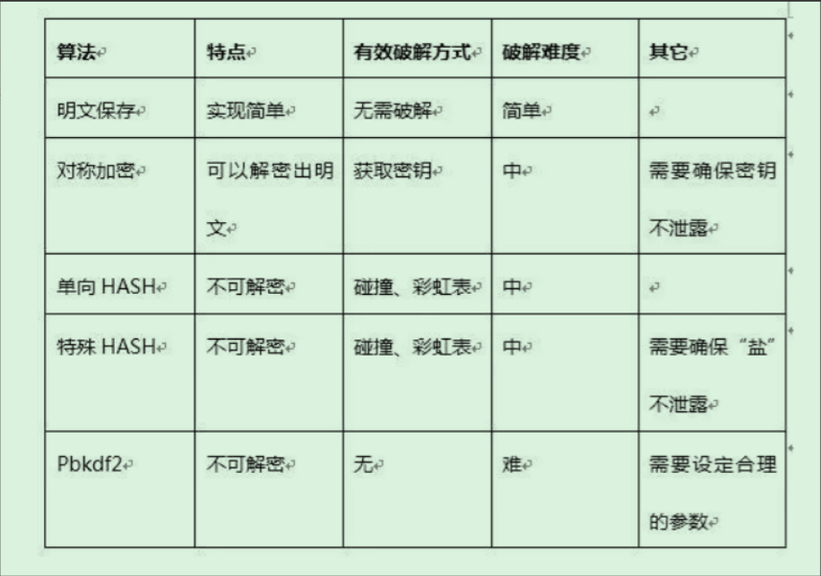
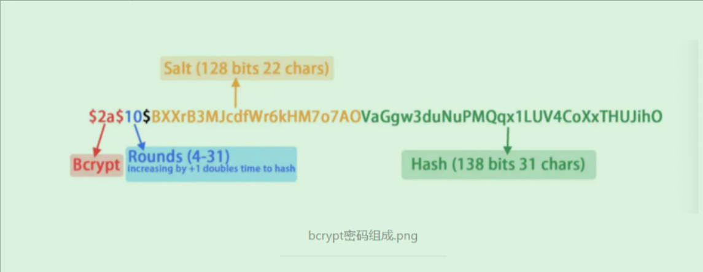

<h3 id="-1">目录</h3>
- [1.各算法对比](#1)
- [2.BCrypt是怎么加密的？](#2)
- [3.那如果黑客使用彩虹表进行hash碰撞呢?](#3)
- [4.那他是如何验证密码的？](#4)
- [5.参考](#5)

<h2 id="1">[1.各算法对比](#-1)</h2>

必须明确一点：

BCrypt是单向Hash加密算法，类似Pbkdf2算法 不可反向破解生成明文。

<h2 id="2">[2.BCrypt是怎么加密的？](#-1)</h2>

BCrypt有四个变量：

`saltRounds`: 正数，代表hash杂凑次数，数值越高越安全，默认10次

`myPassword`: 明文密码字符串

`salt`: 盐，一个128bits随机字符串，22字符

`myHash`: 经过明文密码password和盐salt进行hash，个人的理解是默认10次下 ，循环加盐hash10次，得到myHash
每次明文字符串myPassword过来，就通过10次循环加盐salt加密后得到myHash, 然后**拼接BCrypt版本号+salt盐+myHash等**到最终的BCrypt密码 ，存入数据库中。
这样同一个密码，每次登录都可以根据自省业务需要生成不同的myHash, myHash中包含了版本和salt，存入数据库。

BCrypt密码图解：

如Spring Security crypto 项目中实现的BCrypt方法加密：`BCrypt.hashpw(myPassword, BCrypt.gensalt)`

那即使黑客得到了BCrypt密码，他也无法转换明文，因为之前说了BCrypt是单向hash算法；

<h2 id="3">[3.那如果黑客使用彩虹表进行hash碰撞呢?](#-1)</h2>
有文章指出BCrypt一个密码出来的时间比较长，需要0.3秒，而MD5只需要一微秒（百万分之一秒），一个40秒可以穷举得到明文的MD5，在BCrypt需要12年，时间成本太高，这我就没仔细研究，详细可看陈皓的

[如何防范密码被破解](https://coolshell.cn/articles/2078.html)

<h2 id="4">[4.那他是如何验证密码的？](#-1)</h2>
在下次校验时，从myHash中取出salt，salt跟password进行hash；得到的结果跟保存在DB中的hash进行比对。
如Spring Security crypto 项目中实现的BCrypt 密码验证`BCrypt.checkpw(candidatePassword, dbPassword)`

<h2 id="5">[5.参考](#-1)</h2>
[spring-security bcrypt类](https://github.com/spring-projects/spring-security/blob/main/crypto/src/main/java/org/springframework/security/crypto/bcrypt/BCrypt.java)

[Bcrypt加密](https://www.cnblogs.com/soft-engineer/p/15724281.html)
